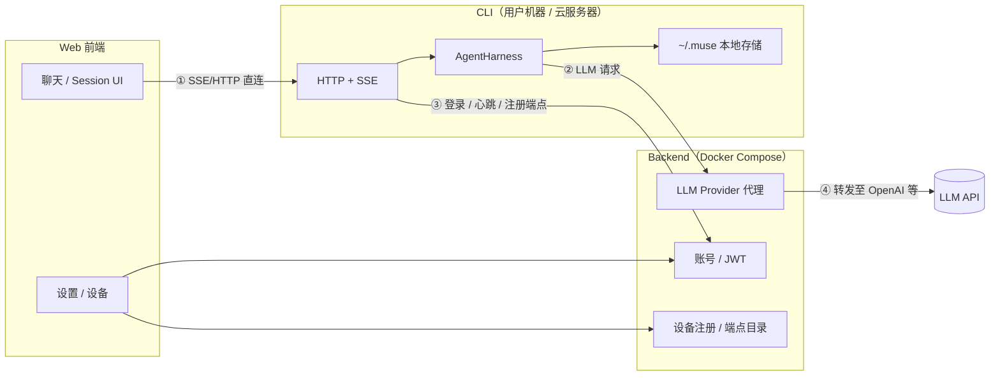

# 架构设计

## 总览



**三条数据路径（已拍板）：**

| 路径 | 走哪 | 原因 |
|------|------|------|
| 聊天流 | Web → **CLI 直连** SSE | 低延迟，不经 Backend 转发 |
| LLM 调用 | CLI → Backend → Provider | API Key 统一在后端，CLI 不存 Key |
| 账号/设备 | Web → Backend；CLI → Backend | 登录、设备列表、在线状态 |

Backend **不转发**聊天 SSE；只提供 CLI 的**端点地址**和**鉴权 token**，Web 拿到后直连 CLI。

---

## 已拍板决策

| 议题 | 决策 |
|------|------|
| Web 连 CLI | 直连 SSE/HTTP，不经 Backend 转发 |
| Session 存储 | 只在 CLI 本地（`~/.muse/sessions/`） |
| MCP 第一期 | 不做通用 MCP 框架；`~/.muse/mcps/` 占位；Tools 内置在 CLI 代码 |
| npm 包名 | `@muse-ai/cli`，本地命令 `muse` |
| 本地开发 | CLI + Web 用 `pnpm dev`；Backend 用 Docker Compose |
| Agent 运行时 | `@earendil-works/pi-agent-core` 的 **AgentHarness** + `@earendil-works/pi-ai`（不用 pi-coding-agent） |

---

## Web 直连 CLI：可行性与技术要点

### 结论

**可行。** Web 直连本地或远程 CLI 都是合理架构；Backend 能「连上」CLI 不等于 Web 自动能连——两者场景不同，但远程 CLI 同样可以做到 Web 直连。

### 本地 CLI（最常见）

Web 与 CLI 在同一台机器：

```
Web (localhost:5173) ──► CLI (localhost:7421)
```

难点少：CORS 允许 dev origin、配对 token 校验即可。

### 远程 CLI（云服务器 / 另一台电脑）

Web 在浏览器里，CLI 在远程机器：

```
Web (https://app.example.com) ──► CLI (https://cli-user.example.com:7421)
         ▲
         └── Backend 只返回 { endpoint, accessToken }，不转发流
```

**Backend 连 CLI vs Web 连 CLI：**

| 方式 | 典型做法 | NAT 友好 |
|------|----------|----------|
| Backend → CLI | CLI **主动**连 Backend（WebSocket 长连、心跳） | ✅ CLI 在内网也行 |
| Web → CLI | 浏览器 **主动**连 CLI 的 HTTP 地址 | ⚠️ 浏览器必须能访问该地址 |

Backend 通过「CLI 出站长连」知道设备在线；Web 仍需一个**浏览器可达**的 CLI 地址。两者不矛盾：

1. CLI 启动后向 Backend 注册：`{ deviceId, endpoint, accessToken }`
2. `endpoint` 可以是公网 IP:端口、域名、Tailscale Serve URL、Cloudflare Tunnel 等
3. Web 从 Backend 拉设备列表，选中设备后用 `endpoint + token` 直连 SSE

### 主要技术难点

| 难点 | 说明 | 应对 |
|------|------|------|
| **浏览器可达性** | 家里/NAT 后的 CLI，外网 Web 无法直接访问 | 云 VM 公网端口、Tailscale Serve、CF Tunnel；或第一期仅支持同机/局域网 |
| **HTTPS / 混合内容** | Web 是 HTTPS 时，浏览器会拦截对 `http://` CLI 的请求 | 远程 CLI 需 HTTPS（反向代理 / tunnel 自带 HTTPS）；本地 dev 可用 HTTP |
| **CORS** | 跨域 SSE 需 CLI 返回正确 CORS 头 | CLI daemon 配置 `Access-Control-Allow-Origin`（允许 Web 域名） |
| **鉴权** | 直连不能把 API Key 给 Web；需证明「这个浏览器用户有权控这个 CLI」 | 配对时 Backend 签发 **device-scoped token**；CLI 校验 `Authorization: Bearer <token>` |
| **在线状态** | Web 需知道 CLI 是否在线 | CLI 定期心跳 Backend；Web 读设备列表里的 `online` 字段（来自心跳，非聊天 relay） |
| **多设备** | 一个账号多台 CLI | Backend 存多设备 endpoint；Web 让用户选择连哪台 |

### 第一期建议

- **必做**：同机 localhost 直连 + 局域网 IP 直连
- **文档预留**：远程 CLI 的 endpoint 注册与 HTTPS 要求
- **可选（阶段 5）**：Cloudflare Tunnel / Tailscale 一键脚本

---

## CLI 内部结构

```
packages/cli/
├── daemon/          # HTTP 服务器、SSE、CORS、鉴权中间件
├── harness/         # MuseHarness（封装 AgentHarness）
├── tools/           # 内置 tools（read_file、list_dir、run_command…）
├── assets/          # 内置 personas、skills
└── commands/        # muse start | login | agent | …

~/.muse/
├── config.json      # Backend URL、deviceId、本地 token 等
├── agents/          # 组装好的 agent 定义
├── personas/
├── skills/
├── mcps/            # 第一期仅占位
└── sessions/        # JSONL session 文件
```

### MuseHarness 封装职责

- 固定 `NodeExecutionEnv`、`JsonlSessionStorage`
- 从 Agent 定义加载 Persona + Skills + active tools
- LLM 请求走 Backend Provider 代理（`getApiKey` 回调指向 Backend）
- 暴露 subscribe 事件供 SSE 转发

---

## Backend 内部结构（规划）

```
packages/server/
├── docker-compose.yml   # Postgres、Redis（仅 server 包使用）
├── auth/                # 注册、登录、JWT
├── provider/            # Provider CRUD、加密存 Key、代理转发
├── device/              # CLI 配对、endpoint 注册、心跳
└── market/              # 后期：Persona/Skill 市场
```

CLI 调 Backend 的典型接口：

| 接口 | 用途 |
|------|------|
| `POST /auth/login` | 用户登录 |
| `POST /devices/pair` | 配对码换 device token |
| `POST /devices/heartbeat` | 上报 online + endpoint |
| `POST /v1/chat/completions` | LLM 代理（兼容 OpenAI 格式或自定义） |

---

## Web 内部结构（规划）

```
packages/web/
├── pages/
│   ├── chat/        # 聊天 + SSE 客户端（直连 CLI endpoint）
│   ├── sessions/    # Session 列表/树（数据来自 CLI API）
│   ├── agents/      # Agent 组装
│   └── settings/    # Provider、设备、主题
└── api/             # 仅调 Backend（不经过 Backend 聊天气）
```

---

## SSE 事件协议（概要）

对齐 pi `AgentEvent` 子集，CLI SSE 推送 JSON 行：

```typescript
// packages/shared/src/events.ts（规划）
type MuseSSEEvent =
  | { type: "agent_start" }
  | { type: "text_delta"; delta: string }
  | { type: "tool_start"; toolName: string; args: unknown }
  | { type: "tool_end"; toolName: string; result: unknown }
  | { type: "turn_end" }
  | { type: "agent_end" }
  | { type: "error"; message: string };
```

Web `POST` 到 CLI 发起对话，`GET /sessions/:id/events` 或单连接 SSE 收流。详细 schema 在阶段 0 定稿后补入 `docs/protocols.md`（待建）。

---

## 安全边界

| 层 | 策略 |
|----|------|
| CLI Tools | 第一期 `run_command` 限制 cwd、超时；敏感路径可后续加 denylist |
| Device Token | 短期 JWT + 可撤销；仅用于 Web→CLI，不含 LLM Key |
| LLM Key | 仅存 Backend 加密字段；CLI 只有 user/device 凭证 |
| Session 数据 | 不出 CLI 磁盘（第一期）；用户自行备份 `~/.muse` |

---

## 本地开发方式

```bash
# Terminal 1 — 后端依赖（Postgres、Redis）
cd packages/server && docker compose up -d

# Terminal 2 — CLI
pnpm --filter @muse-ai/cli dev
muse login
muse start

# Terminal 3 — Web
pnpm --filter @muse-ai/web dev
```

Web 环境变量示例：`VITE_BACKEND_URL=http://localhost:3000`（Backend）、CLI 地址从设备 API 动态获取，不写死。
