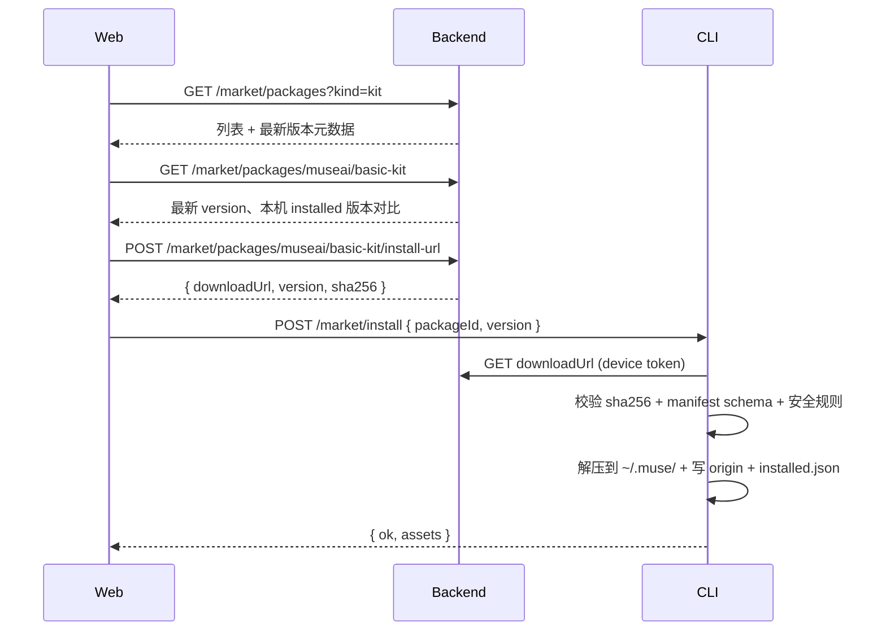
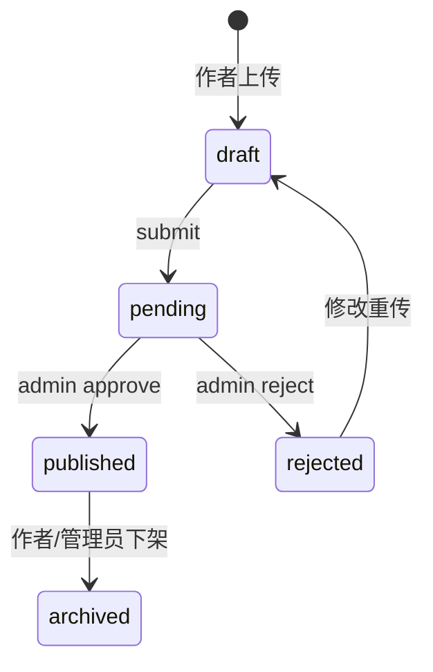

# v0.2 市场 v1 规格

**状态**：✅ v1 已交付（步骤 1–13）  
**最后更新**：2026-06-25  
**关联**：[roadmap.md](../roadmap.md#v02第二期)、[architecture.md](../architecture.md)、[product.md](../product.md)

> 市场 v1 目标：在 Web 浏览 Persona / Skill / 套件（Kit），经 Backend 目录与包存储，由 CLI 安装、卸载、更新到本地 `~/.muse/`。  
> v0.2 首期仅**官方内容**（DB 种子 / CI 入库）；作者上传与审核留后续版本。  
> 实现以 `@museai/shared` 中的 Zod schema 为准；本文档为设计规格，落地时同步更新 [protocols.md](../protocols.md)。

---

## 一句话

**Backend 管目录与包，CLI 管落盘**——市场商品统一为 zip 格式的 `.musepack`；资产 id 为斜杠分隔路径；v0.1 内置资产迁入官方套件 **`museai/basic-kit`**（源码包 **`@museai/basic-kit`**），随 CLI 安装落盘到 `~/.muse/`，版本可升级。

---

## 范围

### v0.2 做

| 能力               | 说明                                                                            |
| ------------------ | ------------------------------------------------------------------------------- |
| 用户名             | 注册时必选、全局唯一；作为市场包 `namespace`（为后续作者发布预留）              |
| 商品类型           | `persona`、`skill`、`kit`（套件）                                               |
| 包格式             | `.musepack`（**zip** + `manifest.json`）                                        |
| 浏览               | Web 市场列表、搜索、详情（**需登录**）                                          |
| 官方内容           | 市场首期仅官方包（如 `museai/basic-kit`）；由 **DB 种子 / CI** 入库，无用户上传 |
| 官方基础套件       | `museai/basic-kit`：monorepo 包 `@museai/basic-kit`；随 CLI 安装；市场可更新    |
| 安装 / 卸载 / 更新 | Web 触发 → CLI 下载、校验、解压、维护安装清单                                   |
| 套件               | 多 Persona/Skill 一次安装；可选 Agent 模板（一键填表，不自动创建）              |
| 本地自建           | 用户在本机创建的 Persona/Skill 使用 `local/` 命名空间                           |

### v0.2 不做

| 能力                                   | 留待                                         |
| -------------------------------------- | -------------------------------------------- |
| **作者上传、审核流**                   | 后续版本（见 [实现步骤](#实现步骤) 步骤 12） |
| 评分、评论、付费                       | v0.3+                                        |
| 包里带 MCP 配置、二进制、可执行脚本    | v0.3 MCP Hub                                 |
| 自动更新、后台静默升级                 | v0.3+                                        |
| 私有 registry / 企业隔离               | v0.4+                                        |
| 安装后自动修改已有 Agent               | —（仅提示引用冲突）                          |
| Backend 向 runtime 流式提供 Skill 内容 | —（始终本地读盘）                            |
| 本机 `~/.muse/` 迁移                   | 实现前手动清空本机数据即可                   |

---

## 资产 id 与命名空间

### 格式

资产 id 为 **斜杠分隔路径**，每段 slug 规则：`^[a-z0-9]+(?:-[a-z0-9]+)*$`。

| 场景                                       | id 规则                     | 示例                                                      |
| ------------------------------------------ | --------------------------- | --------------------------------------------------------- |
| **市场包 id**                              | `{username}/{package-slug}` | `museai/basic-kit`、`kingen/code-reviewer`                |
| **套件内资产**                             | `{packageId}/{asset-slug}`  | `museai/basic-kit/general`、`museai/review-kit/pr-review` |
| **单资产包**（`kind: persona` \| `skill`） | 与包 id **相同**            | `kingen/code-reviewer`                                    |
| **本机自建**                               | `local/{slug}`              | `local/my-draft`                                          |

完整 id 正则（至少两段）：`^[a-z0-9]+(?:-[a-z0-9]+)*(?:/[a-z0-9]+(?:-[a-z0-9]+)*)+$`

示例：

| id                            | 来源                                                                  |
| ----------------------------- | --------------------------------------------------------------------- |
| `museai/basic-kit/general`    | 官方套件 `museai/basic-kit` 内的 Persona（原 v0.1 `general`）         |
| `museai/basic-kit/git`        | 官方套件 `museai/basic-kit` 内的 Skill（原 v0.1 `git`）               |
| `kingen/code-reviewer`        | 用户 `kingen` 发布的单资产 Persona 包（后续版本）                     |
| `museai/review-kit/pr-review` | 官方套件 `museai/review-kit` 内的 Skill                               |
| `local/my-draft`              | 用户在本机 Web/CLI 自建的 Persona；**后续**可发布为 `kingen/my-draft` |

### 目录布局

id 与磁盘路径一一对应：**路径 = id 中 `/` 换成嵌套子目录**。

```text
~/.muse/
├── personas/
│   ├── museai/
│   │   └── basic-kit/
│   │       ├── general/            # museai/basic-kit 安装
│   │       │   ├── persona.json    # id: "museai/basic-kit/general"
│   │       │   ├── system.md
│   │       │   └── .muse-origin.json
│   │       └── coding/
│   │           └── …
│   ├── kingen/
│   │   └── code-reviewer/
│   │       ├── persona.json        # id: "kingen/code-reviewer"
│   │       └── .muse-origin.json
│   └── local/
│       └── my-draft/
│           ├── persona.json        # id: "local/my-draft"
│           └── system.md
├── skills/
│   └── museai/
│       └── basic-kit/
│           ├── git/
│           │   └── SKILL.md        # id: "museai/basic-kit/git"
│           └── review/
│               └── SKILL.md
├── agents/                         # 内置 Agent 随 basic-kit 安装（见下）
└── market/
    └── installed.json
```

`persona.json` 内的 `id` 字段**必须**与目录语义一致（如 `museai/basic-kit/general`）。`MuseAgentRegistry` 对 `personas/`、`skills/` 做**递归**扫描；`resolveAssetDir` 将 id 按 `/` 拆成相对路径。**不再**读取 `packages/cli/assets/`；runtime 只读 `~/.muse/`（内容由 `@museai/basic-kit` 安装写入）。

### `@museai/basic-kit` 包（官方基础套件）

v0.1 的 `packages/cli/assets/` **整体迁入**新 monorepo 包 **`@museai/basic-kit`**（`packages/basic-kit/`），作为 `museai/basic-kit` 的**唯一源码真相**。

```text
packages/basic-kit/
├── package.json              # name: @museai/basic-kit，带 SemVer 版本号
├── manifest.json             # 市场 manifest，id: museai/basic-kit，version 与 package.json 对齐
├── assets/                   # 解压后对应 ~/.muse/ 的布局
│   ├── personas/museai/basic-kit/general/…
│   ├── skills/museai/basic-kit/git/…
│   └── agents/00000000-…/agent.json
└── src/
    └── index.ts              # 导出包 id、版本号、assets 根路径等（供 CLI 安装器使用）
```

| 项               | 说明                                                                                                           |
| ---------------- | -------------------------------------------------------------------------------------------------------------- |
| **与 CLI 关系**  | `@museai/cli` 声明 `dependencies: { "@museai/basic-kit": "workspace:*" }`；用户安装 CLI 时 npm 一并装上        |
| **首装落盘**     | `muse start` 检测无 `museai/basic-kit` → 从 npm 包内 `assets/` 写入 `~/.muse/`（无需 Backend）                 |
| **CLI 升级落盘** | `muse start` 检测本机版本 **低于** npm 包版本 → **自动覆盖**同步（同上写入流程）                               |
| **市场入库**     | 发 npm **前**先将 `.musepack` 入库市场（CI / 种子）；保证市场版本 ≥ npm 随包版本                               |
| **版本**         | `package.json` version、`manifest.json` version、市场 `market_package_versions.version` **三者一致**（SemVer） |
| **市场更新**     | 仅发市场新版、未升 CLI 时，Web 对比版本并显示 **「更新」** 按钮 → `POST /market/update`                        |
| **卸载**         | `museai/basic-kit` **不可卸载**（CLI 拒绝）；其他套件可卸载                                                    |

#### v0.1 → v0.2 id 映射

| v0.1（扁平 id）                | v0.2（scoped id）                                                             |
| ------------------------------ | ----------------------------------------------------------------------------- |
| Persona `general`              | `museai/basic-kit/general`                                                    |
| Persona `coding`               | `museai/basic-kit/coding`                                                     |
| Skill `git`                    | `museai/basic-kit/git`                                                        |
| Skill `review`                 | `museai/basic-kit/review`                                                     |
| 内置 Agent `…0001`（通用助手） | `personaId: museai/basic-kit/general`                                         |
| 内置 Agent `…0002`（编程助手） | `personaId: museai/basic-kit/coding`，`skillIds` 含 `museai/basic-kit/git` 等 |

`packages/cli/assets/` 在实现完成后**删除**；测试 fixture 可继续用简化目录，或依赖 `@museai/basic-kit` 路径。

### 保留命名空间（用户名）

保留名列表维护在 **`@museai/shared`** 常量（`RESERVED_USERNAMES`），**server 与 Web 共用**；注册接口与客户端校验均引用同一列表。

以下 **username** 禁止注册；接口返回与「用户名已存在」相同错误（不暴露「保留」与「占用」的区别）：

| username          | 用途                                        |
| ----------------- | ------------------------------------------- |
| `local`           | 本机用户自建 Persona/Skill（不经市场）      |
| `muse`            | 保留                                        |
| `museai`          | 官方发布账号；**DB 手动种子**，禁止公众注册 |
| `muse-ai`         | 保留                                        |
| `admin`、`api` 等 | shared 常量表扩展项                         |

官方包（含 `museai/basic-kit`）由 `museai` 账号发布；套件内资产 id 为 `{packageId}/{asset-slug}`（如 `museai/basic-kit/general`）。

用户在本机创建资产时，CLI/Web **固定**写入 `local/<slug>`，不要求用户拥有 `local` 账号。

### 用户名规则

| 规则   | 说明                                                            |
| ------ | --------------------------------------------------------------- |
| 格式   | `^[a-z0-9]+(?:-[a-z0-9]+)*$`，3–32 字符                         |
| 唯一   | 全局唯一（DB `users.username` unique）                          |
| 不可改 | v0.2 注册后不可修改（后期可单独立项）                           |
| 大小写 | 存小写；注册输入规范化到小写                                    |
| 保留表 | `RESERVED_USERNAMES`（shared 常量，含上表及 `admin`、`api` 等） |

注册请求增加 `username` 字段；登录仍用 email。

---

## 商品类型

### persona

单个 Persona 目录：`persona.json` + `systemPromptPath` 指向的文件。

### skill

单个 Skill 目录：符合 pi `SKILL.md` 约定（frontmatter + 正文）。

### kit（套件）

一个包内包含多个 Persona / Skill，可选 **Agent 模板**。

```json
{
  "agentTemplate": {
    "name": "PR 审查助手",
    "personaId": "museai/review-kit/code-reviewer",
    "skillIds": ["museai/review-kit/pr-review"],
    "activeToolNames": ["read", "grep", "bash"],
    "description": "可选说明"
  }
}
```

- 安装 kit **只**解压资产并登记 `installed.json`（若 manifest `assets` 含 `type: agent`，则同步写入 `~/.muse/agents/`，如 `museai/basic-kit`）
- 可选 `agentTemplate` 仅用于 Web「从套件创建 Agent」**预填表单**；与 manifest 内显式列出的 `agent` 资产无关
- Web 预填后用户确认，再调用现有 `POST /agents`

---

## 包格式：`.musepack`

实质为 **zip**；扩展名 `.musepack`（实现可用 `fflate` 等，不采用 tar.gz）。

```text
museai-basic-kit-1.0.0.musepack
├── manifest.json
├── personas/
│   └── museai/
│       └── basic-kit/
│           ├── general/
│           │   ├── persona.json
│           │   └── system.md
│           └── coding/
│               └── …
├── skills/
│   └── museai/
│       └── basic-kit/
│           ├── git/
│           │   └── SKILL.md
│           └── review/
│               └── SKILL.md
└── agents/
    ├── 00000000-0000-4000-8000-000000000001/
    │   └── agent.json
    └── 00000000-0000-4000-8000-000000000002/
        └── agent.json
```

包内路径必须与目标 `~/.muse/` 下的相对路径一致（id 中 `/` 对应嵌套目录）。

### manifest.json

```json
{
  "id": "museai/basic-kit",
  "version": "1.0.0",
  "kind": "kit",
  "name": "MuseAI 基础套件",
  "description": "默认 Persona、Skill 与内置 Agent",
  "author": "museai",
  "assets": [
    { "type": "persona", "id": "museai/basic-kit/general" },
    { "type": "persona", "id": "museai/basic-kit/coding" },
    { "type": "skill", "id": "museai/basic-kit/git" },
    { "type": "skill", "id": "museai/basic-kit/review" },
    { "type": "agent", "id": "00000000-0000-4000-8000-000000000001" },
    { "type": "agent", "id": "00000000-0000-4000-8000-000000000002" }
  ],
  "minMuseVersion": "0.2.0"
}
```

非 basic-kit 的 kit 可附加 `agentTemplate`（安装时不自动创建 Agent，仅 Web 预填表单）：

```json
{
  "id": "museai/review-kit",
  "version": "1.0.0",
  "kind": "kit",
  "name": "代码审查套件",
  "author": "museai",
  "assets": [
    { "type": "persona", "id": "museai/review-kit/code-reviewer" },
    { "type": "skill", "id": "museai/review-kit/pr-review" }
  ],
  "agentTemplate": {
    "name": "PR 审查助手",
    "personaId": "museai/review-kit/code-reviewer",
    "skillIds": ["museai/review-kit/pr-review"],
    "activeToolNames": ["read", "grep", "bash"]
  },
  "minMuseVersion": "0.2.0"
}
```

| 字段          | 约束                                                                                 |
| ------------- | ------------------------------------------------------------------------------------ |
| `id`          | 包 id：`{username}/{package-slug}`；单资产包与唯一 asset id 相同                     |
| `version`     | [SemVer](https://semver.org/) `MAJOR.MINOR.PATCH`                                    |
| `kind`        | `persona` \| `skill` \| `kit`                                                        |
| `author`      | 必须等于发布者的 `username`（**后续**上传时 Backend 校验，不信任 manifest 自声明）   |
| `assets`      | `kind !== kit` 时仅 1 项；`kit` 至少 1 项；`type` 含 `persona` \| `skill` \| `agent` |
| `assets[].id` | 套件内须为 `{packageId}/{asset-slug}`；单资产包须等于 manifest `id`                  |

**完整性校验**：归档文件的 **sha256 仅存 Backend**（`market_package_versions.sha256`）；`install-url` 返回给 CLI；**manifest 内不含 sha256**。

**安全（v0.2）**：**不限**包内文件扩展名（Skill 可含脚本、配置等附属文件）；单包上限 **10 MB**；禁止 `..` 路径穿越；**拒绝 zip 内 symlink**。包内脚本等资源**仅落盘**，v0.2 不自动执行；二进制与 MCP 配置仍留 v0.3（见上方「不做」）。

---

## 安装溯源：`.muse-origin.json`

市场安装的每个资产目录下写入：

```json
{
  "packageId": "museai/basic-kit",
  "packageVersion": "1.0.0",
  "installedAt": "2026-06-25T12:00:00.000Z"
}
```

`local/` 自建目录**无**此文件。卸载按 `packageId` 聚合删除；手改过的目录 v0.2 仍允许删除但打日志警告。

### `~/.muse/market/installed.json`

`assets` 与 manifest **对齐**（含 `agent`）：

```json
{
  "packages": {
    "museai/basic-kit": {
      "version": "1.0.0",
      "installedAt": "2026-06-25T12:00:00.000Z",
      "assets": [
        { "type": "persona", "id": "museai/basic-kit/general" },
        { "type": "persona", "id": "museai/basic-kit/coding" },
        { "type": "skill", "id": "museai/basic-kit/git" },
        { "type": "skill", "id": "museai/basic-kit/review" },
        { "type": "agent", "id": "00000000-0000-4000-8000-000000000001" },
        { "type": "agent", "id": "00000000-0000-4000-8000-000000000002" }
      ]
    }
  }
}
```

---

## 安装 / 卸载 / 更新

### `museai/basic-kit` 安装与更新（特殊路径）

| 场景             | 行为                                                                                                                                |
| ---------------- | ----------------------------------------------------------------------------------------------------------------------------------- |
| **CLI 首次启动** | 本机无 `museai/basic-kit` → 从 `@museai/basic-kit` npm 包内 `assets/` **同步落盘**（无需 Backend）                                  |
| **CLI 升级**     | 新 CLI 携带更高版本 `@museai/basic-kit`；`muse start` 时若本机已装版本 **低于** npm 包版本，**自动覆盖**落盘并更新 `installed.json` |
| **市场发新版**   | 仅升级 basic-kit、未发 CLI 时，Web 从 Backend 拉最新 `published` 版本号，显示 **「更新」**                                          |
| **用户点更新**   | Web → CLI `POST /market/update { packageId: "museai/basic-kit" }`；CLI 从 Backend 下载 `.musepack`                                  |
| **卸载**         | 拒绝                                                                                                                                |

发版顺序：**先**市场入库新版本，**再**发 npm；避免出现市场版本低于 npm 随包版本。

### 流程（Web 更新 / 普通市场包安装）



原则：

- **CLI 独占写盘**；Web 不直接写 `~/.muse/`
- CLI 用 **device token** 向 Backend 拉包（与 LLM 代理鉴权一致）
- 安装结束推送设备事件（可选）：`market_installed`，Agents 页可刷新 Persona/Skill 列表

### 卸载

1. Web → CLI `POST /market/uninstall { packageId }`
2. CLI 读 `installed.json`，检查是否有 Agent 引用即将删除的 `personaId` / `skillIds`
3. 若有引用 → **409** + 受影响 Agent 列表；无引用 → 删除资产目录与清单项

### 更新

**`museai/basic-kit`（两条路径）**：

1. **随 CLI 升级（自动）**：`muse start` 时 npm 包版本高于 `installed.json` → 从 npm 包内 assets **自动覆盖**落盘
2. **仅市场发新版（手动）**：Web 对比本机版本与 Backend 最新 `published` 版；`installed < latest` 时显示 **「更新」** → `POST /market/update`；CLI 从 Backend 下载 `.musepack`

**其他市场包**：仅路径 2；v0.2 不后台静默更新。

更新时旧目录备份到 `~/.muse/market/backups/<packageId>@<oldVersion>/`（仅保留一档），并刷新 `installed.json`。

### CLI 命令（v0.2）

| 命令                                 | 说明                                                |
| ------------------------------------ | --------------------------------------------------- |
| `muse market install <packageId>`    | 从 Backend 拉最新 `published` 版（需已登录 / 配对） |
| `muse market install ./foo.musepack` | 本地包调试（dev / CI）                              |
| `muse market uninstall <packageId>`  | 卸载                                                |
| `muse market list`                   | 本机已安装                                          |

---

## Backend 市场模块

目录：`packages/server/src/market/`（规划与 [architecture.md](../architecture.md) 一致）。

### 数据库（Drizzle 草案）

**users** 表增量（v0.2 启动前清空用户数据，**无**既有用户迁移）：

```sql
ALTER TABLE users ADD COLUMN username text NOT NULL UNIQUE;
ALTER TABLE users ADD COLUMN is_admin boolean NOT NULL DEFAULT false;
```

种子数据（部署 / 开发环境 migration seed）：

- 用户 `museai`：`username = 'museai'`；官方包作者
- 市场种子：`museai/basic-kit` 首版 `published`（与 `@museai/basic-kit` 构建产物一致）

**market_packages**（逻辑包，一个 `id` 一条）：

| 列          | 类型          | 说明                                                 |
| ----------- | ------------- | ---------------------------------------------------- |
| id          | text PK       | `museai/basic-kit`                                   |
| author_id   | uuid FK users | 发布者                                               |
| kind        | text          | persona \| skill \| kit                              |
| name        | text          | 展示名                                               |
| description | text          |                                                      |
| status      | text          | v0.2 种子为 `published`；后续扩展 draft / pending 等 |
| created_at  | timestamptz   |                                                      |
| updated_at  | timestamptz   |                                                      |

**market_package_versions**：

| 列            | 类型                  | 说明                        |
| ------------- | --------------------- | --------------------------- |
| package_id    | text FK               |                             |
| version       | text                  | SemVer                      |
| manifest_json | text                  | 完整 manifest               |
| sha256        | text                  | 整个 `.musepack` 文件的摘要 |
| blob_path     | text                  | 对象存储路径                |
| created_at    | timestamptz           |                             |
| PK            | (package_id, version) |                             |

### 包存储

v0.2：**本地文件系统** `packages/server/data/market/<packageId>/<version>.musepack`（`.gitignore`）。  
后续可换 S3 兼容存储，接口不变。

### REST API

Base：`/market`；**所有市场读接口均需 user JWT**（未登录返回 `401`）。

**`packageId` 含 `/`**：路由使用通配，例如 `GET /market/packages/*`，服务端将 `*` 解码为完整 `museai/basic-kit`（Web/CLI 统一 `encodeURIComponent`）。

#### v0.2 实现

| 方法 | 路径                             | 鉴权         | 说明                                                      |
| ---- | -------------------------------- | ------------ | --------------------------------------------------------- |
| GET  | `/market/packages`               | user JWT     | 列表；`?kind=&q=&author=`                                 |
| GET  | `/market/packages/*`             | user JWT     | 详情 + 版本列表                                           |
| POST | `/market/packages/*/install-url` | user JWT     | 返回 `downloadUrl`、`version`、`sha256`（仅 `published`） |
| GET  | `/market/download/*/:version`    | device token | CLI 下载 blob                                             |

#### 后续版本（作者上传 + 审核，见步骤 12）

| 方法   | 路径                         | 说明                               |
| ------ | ---------------------------- | ---------------------------------- |
| POST   | `/market/packages`           | 上传包（multipart），创建/追加版本 |
| POST   | `/market/packages/*/submit`  | 提交审核                           |
| POST   | `/market/packages/*/approve` | 管理员通过                         |
| POST   | `/market/packages/*/reject`  | 管理员拒绝                         |
| DELETE | `/market/packages/*`         | 下架                               |

**注册** `POST /auth/register` 增量字段：

```json
{
  "email": "user@example.com",
  "password": "password123",
  "username": "kingen"
}
```

错误：`username` 已存在（含保留名）→ `409` + `{ "error": "username_taken" }`（i18n：`用户名已存在`）。

---

## CLI API（草案）

鉴权：`Authorization: Bearer <device-access-token>`

| 方法 | 路径                | 说明                                                       |
| ---- | ------------------- | ---------------------------------------------------------- |
| GET  | `/market/installed` | 本机 `installed.json`（含各包 `version`，供 Web 对比更新） |
| POST | `/market/install`   | body: `{ packageId, version? }`                            |
| POST | `/market/uninstall` | body: `{ packageId }`                                      |
| POST | `/market/update`    | body: `{ packageId }`                                      |

`GET /personas`、`GET /skills` 响应增量字段：

```json
{
  "id": "museai/basic-kit/git",
  "name": "Git 工作流",
  "description": "...",
  "source": "market"
}
```

`source`：`local` | `market`（`local/` 前缀为 `local`；有 `.muse-origin.json` 为 `market`）。

---

## Web UI（v0.2）

| 页面 / 入口                  | 说明                                                                                   |
| ---------------------------- | -------------------------------------------------------------------------------------- |
| `/market`                    | 列表：卡片展示 kind、作者、简介                                                        |
| `/market/:packageId`         | 详情、已装版本 vs 最新版本、**更新** / 安装 / 卸载按钮                                 |
| `/market/installed` 或设置页 | 已安装列表；`museai/basic-kit` 显示当前版本与更新入口                                  |
| Agents 页                    | Persona/Skill 下拉显示 `source` 标签；「从已安装套件创建」入口（`agentTemplate` 预填） |
| 注册页                       | 增加用户名；校验规则与 `RESERVED_USERNAMES`                                            |

市场浏览需**登录**；安装 / 卸载 / 更新需**在线 CLI**（无设备时可逛市场，安装按钮引导配对，与聊天页一致）。

---

## 审核流（后续版本）

v0.2 **不实现**。后续引入作者上传时启用：



---

## 与现有代码的衔接

| 模块                | 变更要点                                                                                                                         |
| ------------------- | -------------------------------------------------------------------------------------------------------------------------------- |
| `@museai/basic-kit` | **新建** `packages/basic-kit/`；迁入原 `cli/assets`；`manifest.json` + 构建 `.musepack` 脚本                                     |
| `@museai/shared`    | `marketManifestSchema`、`installedPackageSchema`、scoped id 校验、`RESERVED_USERNAMES`、`AssetSource`、`BASIC_KIT_PACKAGE_ID` 等 |
| `packages/core`     | `MuseAgentRegistry`：移除 bundled 回退；递归列举；`resolveAssetDir` 全路径；内置 id 常量 → `museai/basic-kit/*`                  |
| `packages/cli`      | 依赖 `@museai/basic-kit`；删除 `assets/`；`MarketInstaller`（含首装 basic-kit）；daemon `/market/*`                              |
| `packages/server`   | `users.username`；种子 `museai` + `museai/basic-kit`；`market/` 读路由 + 下载                                                    |
| `packages/web`      | `/market` 页；注册用户名；包详情 **更新** 按钮；Agents 页 `source` 展示                                                          |

---

## 实现步骤

按依赖顺序执行；步骤 1–4 可在无 Backend 情况下用 npm 包内 assets 完成首装联调。

| #   | 步骤                        | 任务                                                                                                                                                     | 验收                                   |
| --- | --------------------------- | -------------------------------------------------------------------------------------------------------------------------------------------------------- | -------------------------------------- |
| 1   | **`@museai/basic-kit`**     | 新建 `packages/basic-kit/`；从 `cli/assets` 迁入；id 改为 `museai/basic-kit/*`；`manifest.json`（无 sha256）                                             | 目录布局与本文一致                     |
| 2   | **basic-kit 构建**          | `pnpm pack:musepack`（或同等脚本）产出 `.musepack`；sha256 由脚本输出供 seed 使用                                                                        | zip 可解压且 manifest 合法             |
| 3   | **`@museai/shared`**        | `marketManifestSchema`、`installedPackageSchema`、scoped id Zod、`RESERVED_USERNAMES`、`BASIC_KIT_PACKAGE_ID`、更新 `BUILTIN_*` 常量                     | 单测通过                               |
| 4   | **`packages/core`**         | `MuseAgentRegistry`：去 bundled；递归 list personas/skills；`resolveAssetDir` 按 `/` 拆路径                                                              | 测试 fixture 改为嵌套目录              |
| 5   | **CLI 首装**                | `@museai/cli` 依赖 basic-kit；`MarketInstaller.syncBasicKit()`；`muse start` 首装/升级落盘；写 `installed.json` + `.muse-origin.json`（assets 含 agent） | 无 Backend：装 CLI → 默认 Agent 可聊天 |
| 6   | **清理 v0.1 资产**          | 删除 `packages/cli/assets/`；改 `assets-path.ts`、`deps.ts`                                                                                              | `pnpm test` 全绿                       |
| 7   | **Server 账号**             | migration：`users.username`；注册 API + 保留名校验；Web 注册页                                                                                           | 保留名返回 `username_taken`            |
| 8   | **Server 市场**             | `market_packages` / `market_package_versions` 表；本地 blob；种子 `museai` + `museai/basic-kit`                                                          | docker compose up 后可列表/详情        |
| 9   | **Server 读 API**           | `GET packages`、`GET packages/*`、`POST install-url`、`GET download`（通配路由 + device token）                                                          | curl 可拿 install-url 并下载           |
| 10  | **CLI 市场安装器**          | 下载、sha256 校验、解压、体积上限 10 MB、防 `..`、拒 symlink；install / update / uninstall + 备份；卸载引用检查 409；拒卸 basic-kit                      | 单测 + 本地 `.musepack` 调试命令       |
| 11  | **CLI daemon**              | `GET /market/installed`、`POST install/uninstall/update`；`GET /personas`、`/skills` 增 `source`；可选 `market_installed` 事件                           | Web 可调通                             |
| 12  | **Web 市场**                | `/market` 列表与详情；已装 vs 最新版本；安装/更新/卸载；无 CLI 时引导配对；Agents 页 `source` 与套件预填                                                 | 对照验收标准 1–7                       |
| 13  | **收尾**                    | 更新 `protocols.md`；CI 构建 basic-kit `.musepack` 并 seed；端到端：注册 → 配对 → 逛市场 → 装包 → 聊天                                                   | 文档与 CI 就绪                         |
| 14  | **作者上传 + 审核**（后续） | 上传 API、`muse market publish`、审核流、`is_admin` 管理页；`local/*` 发布为 `{username}/*`；上传时校验 `author === username`                            | 独立里程碑                             |

---

## 验收标准（v0.2 市场 v1）

1. 注册时选择用户名；`RESERVED_USERNAMES` 内名称不可注册，提示「用户名已存在」
2. 安装 `@museai/cli` 后首次 `muse start`，本机自动落盘 `museai/basic-kit`（无需 Backend）
3. DB 种子含 `museai` 用户与已发布 `museai/basic-kit`；存在 `museai/basic-kit/general` 等资产；默认 Agent 可会话
4. CLI 升级后 `muse start`，本机 `museai/basic-kit` **自动**升至 npm 包版本；仅市场发新版时需 Web 点「更新」
5. 其他 kit 卸载时若有 Agent 引用则阻止并列出
6. 用户自建 Persona 落在 `local/<slug>`，与市场包区分展示（`source`）
7. 未登录访问 `GET /market/packages` 返回 `401`

---

## 已拍板决策

| #   | 决策                                                                                                     |
| --- | -------------------------------------------------------------------------------------------------------- |
| 1   | 市场列表与详情 **需登录**（user JWT），未登录 `401`                                                      |
| 2   | **无**既有用户 `username` 迁移；v0.2 启动前清空 DB 用户数据；本机 `~/.muse/` 实现前手动删除              |
| 3   | `.musepack` 仅 **zip**，不用 tar.gz                                                                      |
| 4   | v0.1 内置资产迁入 **`@museai/basic-kit`**，市场 id **`museai/basic-kit`**；官方账号 **`museai`** DB 种子 |
| 5   | `@museai/cli` **依赖** `@museai/basic-kit`；删除 `packages/cli/assets/`；runtime 只读 `~/.muse/`         |
| 6   | CLI 升级时 basic-kit **自动覆盖**；仅市场发新版时 Web **「更新」** 按钮手动升级                          |
| 7   | **sha256 仅存 Backend**；manifest 内不含 sha256                                                          |
| 8   | `packageId` 路由用 **通配** `/*`；客户端 `encodeURIComponent`                                            |
| 9   | `installed.json` 的 `assets` 与 manifest **对齐**（含 agent）                                            |
| 10  | 发版顺序：**先**市场入库，**再**发 npm                                                                   |
| 11  | v0.2 市场仅 **官方内容**（种子/CI）；**不做**作者上传与审核                                              |
| 12  | zip 内 **拒绝 symlink**；`RESERVED_USERNAMES` 放 **shared**，server 与 Web 共用                          |
| 13  | `local/my-draft` **后续**可发布为 `{username}/my-draft`；上传时 Backend 校验 `author === username`       |
| 14  | 包内 **不限扩展名**；单包上限 **10 MB**；脚本等仅落盘，v0.2 不自动执行                                   |

---

## 相关文档

- [roadmap.md](../roadmap.md) — v0.2 总览
- [current-phase.md](../current-phase.md) — 进度快照
- [protocols.md](../protocols.md) — 落地后补充市场与 CLI 路由
- [releases/v0.1.md](../releases/v0.1.md) — 基线能力
